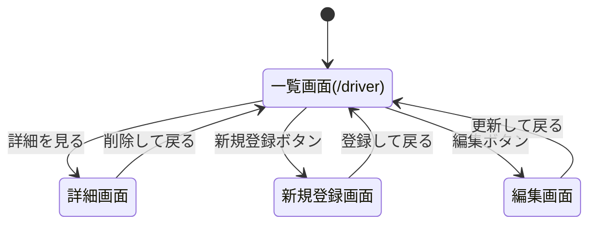

# 開発者用仕様書 (仮)

## 1. 概要
イヤホンやヘッドホンに搭載されるドライバーユニットの情報をまとめたWebアプリケーション。
REST APIライクな設計により、データの閲覧、追加、編集、削除を行う。

## 2. データ構造
ドライバーユニットの情報は以下のオブジェクト配列として変数 `driver` に保持する。

```json
[
  {
    "id": 1,
    "code": "DD",
    "name": "ダイナミックドライバー",
    "cost": "比較的安価",
    "Features": "現在最も広く普及しているユニット,一つで広い範囲の周波数の音を鳴らすことができる",
  }
]
```

## 3. ページ遷移図 (Mermaid)

